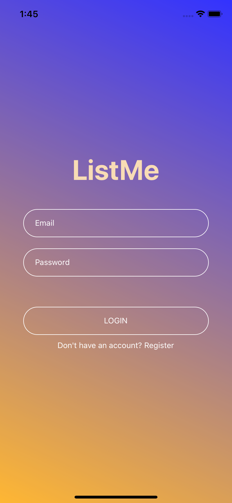
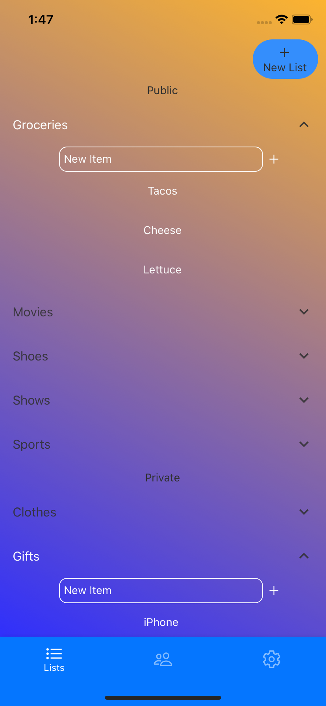
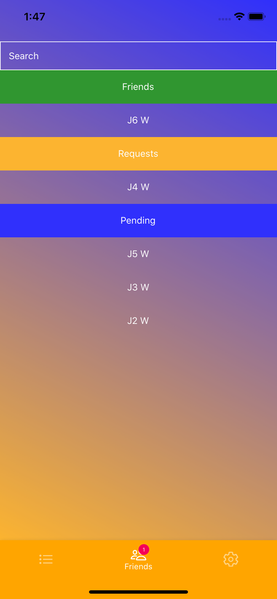

# ListMe
React native application to keep track of all your lists.

Share public lists with friends and keep private lists to your self.

## Preview





## How To Run Project

1. Clone down project
1. Run ```npm install```
1. Run ```npm start```

## Technologies Used

1. React Native
1. Expo
1. Firebase
1. Firebase realtime database